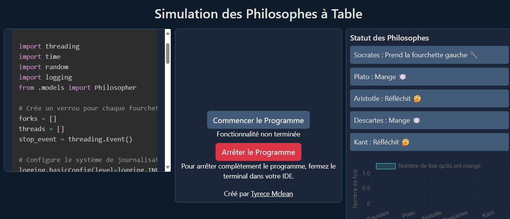

ATTENTION : TRAVAIL SUPPLÉMENTAIRE !

🔴 **Ceci est un travail supplémentaire que j'ai réalisé pour étendre le projet.**

🔴 **Si vous souhaitez uniquement voir le script principal, rendez-vous dans :**
```
mysite/polls/simulation.py
```

🔴 ** le site est à jour sur mon serveur à l'adresse suivante :**
```
techwithtyrece.com/dinerdesphilosophes
```

# Simulation des Philosophes à Table




Cette application web simule le problème classique des philosophes à table, illustrant les concepts de synchronisation et d'évitement des interblocages en programmation concurrente.

## Accès à l'application

L'application web sera accessible à l'adresse suivante une fois déployée :
```
http://localhost:8000
```

## Prérequis

Pour exécuter cette application, vous aurez besoin de :

- Python 3.8 ou plus récent
- Django 4.0 ou plus récent
- Channels pour le support WebSocket
- Daphne comme serveur ASGI

## Installation

1. Clonez ce dépôt :
```bash
git clone https://github.com/yourusername/dinerdesphilosophes.git
cd dinerdesphilosophes
```

2. Créez un environnement virtuel et activez-le :
```bash
python -m venv venv
# Sur Windows
venv\Scripts\activate
# Sur macOS/Linux
source venv/bin/activate
```

3. Installez les dépendances nécessaires :
```bash
pip install django channels daphne
```

4. Configurez votre fichier settings.py pour inclure Channels :
```python
INSTALLED_APPS = [
    # ...autres applications...
    'channels',
    'polls',
]

# Configuration de Channels
ASGI_APPLICATION = 'mysite.asgi.application'
CHANNEL_LAYERS = {
    'default': {
        'BACKEND': 'channels.layers.InMemoryChannelLayer',
    },
}
```

5. Appliquez les migrations de base de données :
```bash
python manage.py migrate
```

6. Créez un superutilisateur (facultatif) :
```bash
python manage.py createsuperuser
```

## Exécution de l'application

Pour démarrer l'application en utilisant Daphne (serveur ASGI) :

```bash
daphne -b 0.0.0.0 -p 8000 mysite.asgi:application
```

Cette commande lance le serveur et le rend accessible sur toutes les interfaces (0.0.0.0) sur le port 8000.

## Structure du projet

```
dinerdesphilosophes/
|
├── mysite/                  # Projet Django principal
│   ├── asgi.py              # Configuration ASGI
│   ├── settings.py          # Paramètres du projet
│   ├── urls.py              # Configuration des URLs
│   └── wsgi.py              # Configuration WSGI
│
└── polls/                   # Application Django pour la simulation
    ├── models.py            # Modèles de données (Philosopher, etc.)
    ├── views.py             # Vues pour l'application
    ├── urls.py              # URLs de l'application
    ├── consumers.py         # Consumers WebSocket
    ├── simulation.py  # Script principal de simulation
    └── templates/           # Templates HTML
        └── polls/
            └── index.html   # Interface utilisateur principale
```

## Fonctionnalités

- Visualisation en temps réel de l'état des philosophes
- Statistiques sur le nombre de repas pris par chaque philosophe
- Interface utilisateur intuitive avec code source visible
- Démarrage et arrêt de la simulation

## Contribution

Les contributions sont les bienvenues ! N'hésitez pas à ouvrir une issue ou à soumettre une pull request.

## Auteur

Créé par [Tyrece Mclean](https://github.com/tyrecemclean)

## Licence

Ce projet est sous licence [MIT](LICENSE).

